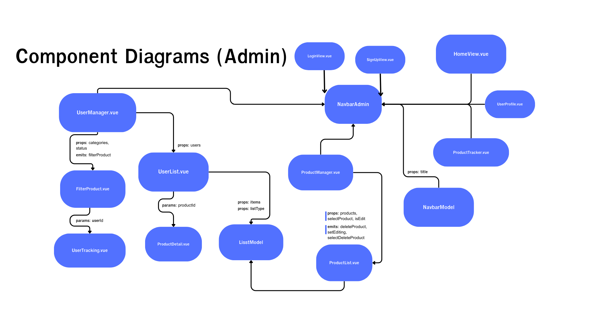
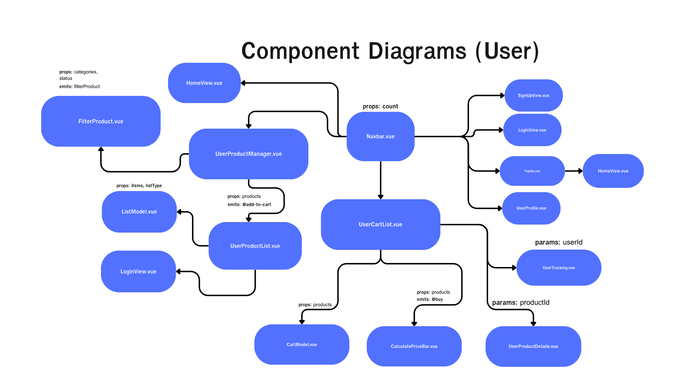

# PROJECT1-SEC-1-Kittiphop.vue 🇰 🇮 🇹 🇹 🇮 🇵 🇭 🇴 🇵 . 
## รายละเอียดโปรเจค 🔻
**หัวข้อโปรเจค: ระบบจัดการสินค้า**  
- เป็นเว็บไซต์จำลองระบบ ecommerce ที่จะเเบ่งออกมาเป็นสองฝ่ายทั้งฝ่าย user เเละ admin โดยที่ user สามารถสร้างบัญชี,เติมเงิน,ซื้อสินค้า,ติดตามสินค้า ฯลฯ โดยที่ admin เเละ admin สามารถจัดการกับสินค้า ทำ CRUD ได้ทั้งหมด เเละอัปเดตสถานะ tracking ให้กับ user ได้อีกด้วย 

## รายชื่อสมาชิกและหน้าที่รับผิดชอบ

**หน้าที่รับผิดชอบในแต่ละ Week**

| รหัสนักศึกษา  | ชื่อ - นามสกุล          |      Week 1      | Week 2 | Week 3 | Week 4 | Week 5 | เปอร์เซ็นการรับผิดชอบงาน |
|---------------|-----------------|:----------------:|:------:|:------:|:------:|:------:|:------------------------:|
| 66130500009  | กิตติภพ ศิรานนท์ชัย     | create product (admin-side)   |   create product to backend (admin-side)  |  read product in cart (user-side)  |  add product to cart (user-side)  |  check bug and fix  |           20%            |
| 66130500046  | ธีรภัทร แสงมาน      | filter product (admin-side)   |   filter components (admin&user-side)   |  Userlist,UserManager and get user by id for tracking   |   tracking product Admin,User FilterComponent for User  |   check bug and fix  |           20%            |
| 66130500056  | ปรเมษฐ์ ขันทอง      | design ui    |   delete product (admin-side)   |   delete multiple products (admin-side)  |   buy product (user-side)   |   check bug and fix   |           20%            |
| 66130500059  | ปวริศญ์ สำเรียง       | update product (admin-side)   |   create function update ui (admin-side) |  re-design add,update (admin-side)   |   checking box product(admin-side)   |    check bug and fix   |           20%            |
| 66130500062  | พงศกร สินสมบูรณ์สุข    | creating ui |   retrieve product (admin-side)    |   retrieve product by id (admin-side)  |   Authentication system and ui (admin&user-side)   | check bug and fix |           20%            |

---

**Progress งานในแต่ละ Week**
| รหัสนักศึกษา | Progress Week1 | Progress Week2 | Progress Week3 | Progress Week4 | Progress Week5 |
|---------------|----------------|----------------|----------------|----------------|----------------|
| 66130500009   | create addProduct | create product from backend  | addToCart, readProduct in cart | addQuantity, decreaseQuantity,            | toggleEditMode, fixAddToCart, CalculateBar component |
| 66130500046   | filter product | filter components  | search and category function              |  Userlist,UserManager and get user by id for tracking             | tracking product Admin,User FilterComponent for User               |
| 66130500056   | delete product and design ui. |  delete product by id and ui           |  delete multiple products (admin-side)  | add top-up for user        |buy product (user-side) also check bug and fix and Add ProductList Home Page And Fix all UI, Responsive also fix/add function validate              | 
| 66130500059   | update Product ui | update product from backend     | Improve UI page  Admin Side         | Create Product RealTime Tracker              | Fix Product Tracker & Improve UI Component             |
| 66130500062   | creating ui | add retrieve product feature, add components | add get product by id , add ProductDetail component and ui | add Authentication system and ui | improve responsive ui, update fetch product using state management |

---
### 🃏ฟีเจอร์หลัก (Features)
- ฟีเจอร์ล็อคอิน เเละ ลงทะเบียน - การ Login หลักๆจะมีสอง role ได้แก่ admin  และ users ทั่วไป, การลงทะเบียน user ทั่วไป  
- ฟีเจอร์การลงทะเบียน ฟิลด์ password จะไม่เก็บเป็น plain text แต่จะมีการเข้ารหัสแบบง่าย ๆ เอาไว้ก่อน
**ฝั่ง admin** 
- ตรวจสอบและจัดการคลังสินค้า - เพิ่ม,เรียกดู,อัพเดท,ลบ สินค้าภายในคลัง  
- ฟีเจอร์ส่งของให้ลูกค้า tracking สินค้า พร้อมบอก status การขนส่ง  
- filter ในการเลือกดูสินค้าได้ มีทั้ง search by เเละ filter by category

**ฝั่ง users** 
- ฟีเจอร์ที่ลูกค้าสามารถซื้อของได้ - filter เรียกดูสินค้าทั้งหมด,เรียกดูรายละเอียดสินค้านั้น ๆ   - เพิ่มสินค้าเข้าตะกร้า,ลบสินค้าในตะกร้า 
- ฟีเจอร์เติมเงิน
- อัปเดตข้อมูลส่วนตัว
- ดูสถานะ tracking ได้

** User ที่พร้อมใช้งานสำหรับอาจารย์ สามารถดูได้จาก property _comment ใน db.json
user ทั่วไป
- username : ajarn@gmail.com , password : Ab12345@
user admin
- username : admin@gmail.com , password : Bb123456789@
--- 
### Component Design 
- Admin

- User
  
--- 
### คู่มือการใช้งานแอปพลิเคชัน 
--- 
### วิดิโอสาธิตการทำงานของเว็บไซต์
[Watch the video](link)

--- 
### แหล่งข้อมูลอ้างอิงหรือเป็นแรงบันดาลใจในการพัฒนา
- [ref 1 ไอเดีย ](https://teamseas.org/)
- https://shopee.co.th/
- 
---

## วิธีการใช้งาน 💻
1. git clone : ` https://github.com/P4warit06/PROJECT2-SEC-1-Kittiphop.vue.git `
2. change directory ไปที่โฟลเดอร์ที่มีการ clone project นี้ลงไป ใช้คำสั่ง `cd your : path/path/path`
3. จากนั้นตรวจสอบว่าใน folder มีการติดตั้ง Node Module หรือยัง ถ้ายังให้ใช้คำสั่ง `npm install`  หรือ `npm i`
4. จากนั้นทดลองรันโปรเจคด้วยคำสั่ง `npm run dev `
5. จากนั้นให้ตรวจสอบว่าปรากฎตัว "localhost:xxxx" ให้ทดสอบหรือไม่
---

## Tool ที่ใช้ในโปรเจคนี้ 🔍
- Vue.js 
- JavaScript 
- HTML / Tailwind Framework &nbsp;   |  
- Daisy UI for icon  
---

### หมายเหตุ:
หากพบปัญหาหรือข้อผิดพลาดในการรันโปรเจค  กรุณาติดต่อสมาชิกในทีมเพื่อแก้ไขปัญหาดังกล่าว
